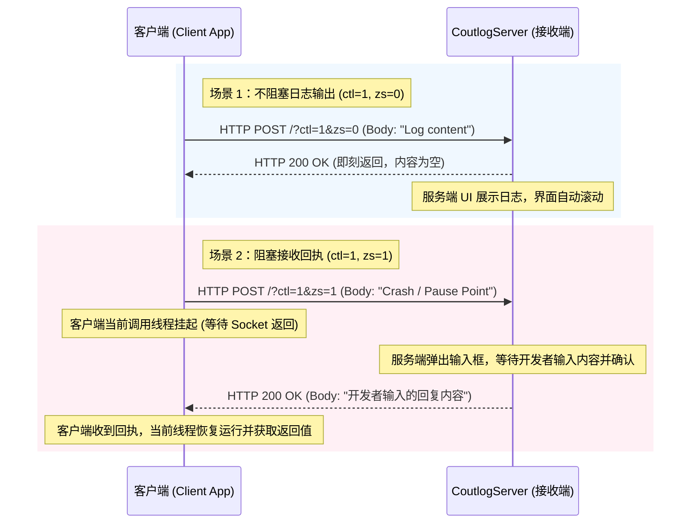

# CoutlogServer

CoutlogServer 是一个轻量级、跨语言的交互式远程调试控制台日志服务器，专为 C++ 和 易语言（EasyLanguage）开发者设计。它通过简单的 HTTP 协议实现日志的收集与管理，并支持极其强大的**交互式挂起（阻塞）调试**以及**窗口智能贴合**功能。

---

## 🌟 核心特性

1. **多维度日志展示**：
   - **文本视图**：直观展示连续日志流，支持自动换行与自动滚动。
   - **列表视图**：按时间顺序记录日志，清晰展示时间戳，并支持双击直接打开或定位关联的外部日志文件。
2. **交互式挂起调试（特色功能）**：
   - 在客户端发送日志时，可选择**阻塞模式**。
   - 此时，服务端（CoutlogServer）会弹出输入框挂起该请求，客户端则暂停执行（等待网络响应）。
   - 开发者在服务端输入反馈内容后，该内容将作为 HTTP 响应返回给客户端，实现**双向交互调试**。
3. **文件与资源记录**：
   - 支持客户端直接通过 HTTP POST 发送文件/二进制数据，服务端自动落盘至临时目录，并在 UI 中提供双击直接打开的快捷方式。
4. **窗口智能贴合（靶子工具）**：
   - 界面底部提供“靶子”图标。按住并拖动该图标至任意外部程序窗口，CoutlogServer 会自动计算其位置与大小，并完美覆盖/贴合到目标窗口上，非常方便并排调试。
5. **极简通信协议**：
   - 基于标准 TCP socket 实现的轻量级 HTTP 协议，客户端集成非常简单，无任何沉重依赖。
6. **精致的 Win32 UI 设计**：
   - 采用 `BEWin32UI` 框架，无边框设计。
   - 智能读取 Windows 系统注册表的主题色（Accent Color），自动与系统的个性化主题色完美适配。
   - 支持窗口阴影、悬停高亮、托盘图标最小化及右键菜单等细节。

---

## 📡 通信流程

CoutlogServer 内置了一个轻量级的 HTTP 服务器（默认监听 `10086` 端口），客户端通过标准 `HTTP POST` 发送请求。

### 接口定义

| 参数名 | 类型 | 说明 |
| :--- | :--- | :--- |
| `ctl` | `int` | 控制码：`0` = 清空日志；`1` = 文本日志；`2` = 文件/二进制日志 |
| `zs` | `int` | 是否阻塞（Zusai）：`0` = 无需回执；`1` = 阻塞（服务端弹出输入框，客户端当前调用线程挂起，等待服务端输入并返回回执） |
| `ext` | `string` | 文件后缀名（仅在 `ctl=2` 时有效，默认为 `log`） |

- **请求路径**：`POST /?ctl=<控制码>&zs=<是否阻塞>&ext=<文件后缀>`
- **请求体 (Body)**：
  - `ctl=1` 时，Body 为 **UTF-8 编码的日志文本**。
  - `ctl=2` 时，Body 为 **文件的原始二进制数据**。
  - `ctl=0` 时，Body 为空。

### 交互时序图



---

## 🛠️ 项目结构

```
coutlogServer/
├── Client/                      # 客户端 SDK
│   ├── C++/                     # C++ SDK & 示例程序
│   │   ├── coutlog/             # C++ 客户端核心源码
│   │   └── coutlog.sln          # VS 解决方案
│   └── E/                       # 易语言 SDK & 示例程序
│       ├── 支持库/               # 编译好的 fne 支持库和 static 静态库
│       ├── 简单测试.e            # 基础通信测试用例
│       └── 多线程调试输出服务器的例子.e
└── Server(BEC++)/               # 服务端源码 (基于 BEWin32UI 框架)
    ├── coutlogServer/           # 服务端核心代码 (HTTP服务、窗口逻辑)
    └── coutlogServer.sln        # 服务端 VS 解决方案
```

------

## 

## 💻 客户端接口 (Client APIs)

### C++ 客户端

C++ 客户端提供了高度封装的头文件 [coutlog.h](file:///Client/C++/coutlog/coutlog.h) 及源文件 [coutlog.cpp](file:///Client/C++/coutlog/coutlog.cpp)。

#### 1. 配置调试目标 `coutlog_option`
```cpp
void coutlog_option(c_StrX host, bool isStop = false);
```
- **host**: 格式为 `IP:Port`，例如 `"127.0.0.1:10086"`。如果不带端口，默认使用 `10086`。
- **isStop**: 是否停止所有的日志输出。设为 `true` 后，后续的所有日志输出均会直接跳过，避免影响生产环境性能。

#### 2. 设置单次临时目标 `coutlog_optionT`
```cpp
void coutlog_optionT(c_StrX host);
```
- 改变下一次发送的日志目标，在下一次发送完成后自动还原为之前的 host 配置。

#### 3. 发送文本日志 `coutlog`
```cpp
StrU8 coutlog(c_AutoStr str, bool zusai = false);
```
- **str**: 待发送的日志文本。
- **zusai**: 是否阻塞调试。若为 `true`，函数将挂起并等待服务端返回输入的内容。
- **返回值**: 服务端返回的回复字符串。

#### 4. 发送二进制/文件日志 `coutlogR`
```cpp
StrU8 coutlogR(c_Bytes str, bool zusai = false, c_AutoStr ext = "log");
```
- **str**: 文件的字节流数据。
- **zusai**: 是否阻塞调试。
- **ext**: 保存文件的后缀名（例如 `"png"`, `"json"`, `"txt"` 等）。
- **返回值**: 服务端保存日志文件的相对路径。

#### 5. 格式化日志输出 `coutlogV`
```cpp
template <typename... Args>
void coutlogV(Args&&... args);
```
- 变参模板函数，支持任意类型、任意数量参数的拼接输出，内部调用系统打印机制。例如：
  `coutlogV("ID: ", 1024, " Info: ", L"测试");`

#### 6. 清空日志服务器内容 `coutClear`
```cpp
void coutClear();
```
- 发送指令清空服务端的文本框和列表框。

---


## 🚀 快速开始

### 1. 运行服务端
打开 `Server(BEC++)\coutlogServer.sln` 进行编译运行。运行后将在本地监听端口 `10086`。
- 可勾选“自动滚动”、“自动换行”，或在此处修改即时监听的端口。

### 2. 在 C++ 项目中接入
在您的 C++ 工程中引入 `coutlog.h` 和 `coutlog.cpp`，示例如下：

```cpp
#include "coutlog.h"

int main() {
    // 1. 初始化目标服务器 IP 与端口
    coutlog_option("127.0.0.1:10086");
    
    // 2. 清空服务端当前的日志显示
    coutClear();

    // 3. 发送普通日志 (不阻塞)
    coutlog("Hello, CoutlogServer!");

    // 4. 格式化日志
    coutlogV("Value of PI is roughly ", 3.14159, " and status is: ", true);

    // 5. 发送日志并接收回执 (当前线程会挂起，等待服务端输入并返回)
    StrA reply = coutlog("Breakpoint hit! Continue? [yes/no]", true);
    if (reply == "yes") {
        coutlog("Client resumed and continuing...");
    } else {
        coutlog("Client terminated by remote command.");
    }
    
    return 0;
}
```

### 3. 在易语言中接入
1. 将 `Client/E/支持库/coutlog.fne` 复制到易语言安装目录下的 `lib` 目录中。
2. 将 `coutlog_static(NOP).lib`、`coutlog_static(YES).lib`、`coutlog_static.lib` 复制到易语言安装目录下的 `static_lib` 目录中。
3. 重启易语言，勾选“白易远程控制台日志输出”支持库，即可在代码中直接使用调试输出命令。
